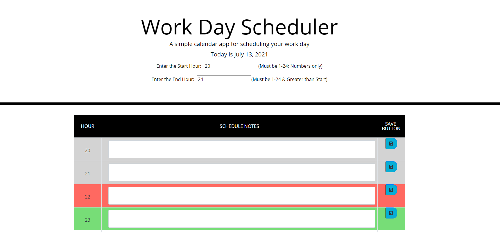

[Week 5 - 3rd Party API Work Day Scheduler](https://lukeajcole.github.io/W5_Day_Scheduler_LAJC/index.html)

DESCRIPTION:
This project creates a very basic day planner. The user can enter their notes about scheduled items throughout their day and update them as needed. 

HOW IT WORKS:
JQUERY is used in combination with BOOTSTRAP in order to dynamically create and style html elements on the page. The JS library "MOMENTS" is also called in order to get the date. 

NOTES:
1. The data is stored in local storage
1. The user can select the hour range they want to schedule for. 
1. There past, current, and future hours are indicated with grey, red, and green colors, respectively

